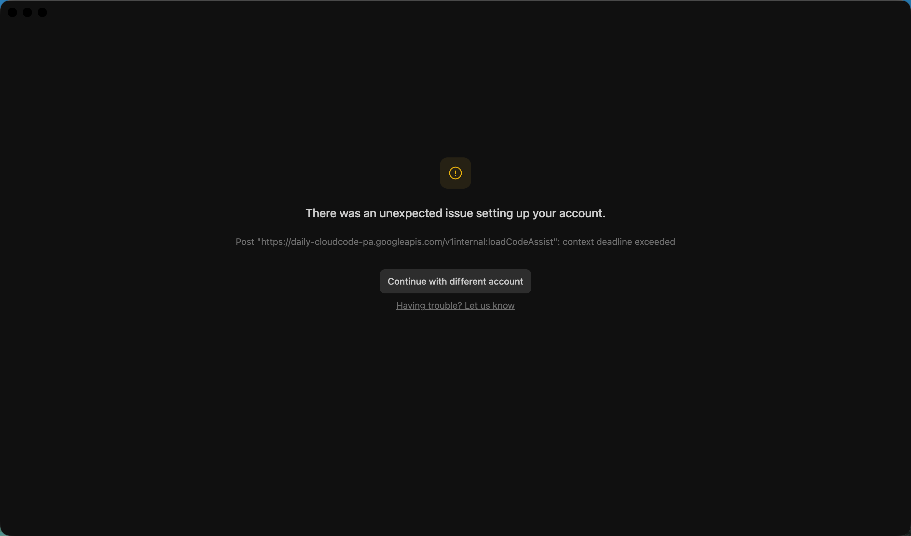

# Antigravity 登录修复（macOS / 中国大陆）

> 解决 Google Antigravity IDE 在 macOS 上登录后卡在 "There was an unexpected issue setting up your account" 的完整方案。
>
> 适用版本：**Antigravity 2.0.6**（macOS arm64 / x86_64）。

## 这是什么问题

走完 Google OAuth 后 Antigravity 主界面弹错误：

> There was an unexpected issue setting up your account.
> Post `https://daily-cloudcode-pa.googleapis.com/v1internal:loadCodeAssist`: context deadline exceeded



或者 OAuth 阶段直接 `Token exchange failed: ETIMEDOUT`。

很多人会以为是代理没开 / 端口写错，**但代理通了也修不好**。GPT-5、Claude、Gemini 都试过环境变量、换端口、改 `argv.json` —— 都没用。

## 真正的根因（双重 bug 叠加）

| # | 问题 | 影响 |
|---|------|------|
| 1 | Antigravity 2.0.6 的 `app.asar` 把 cloud code 端点 hardcode 成了 `daily-cloudcode-pa.googleapis.com`（Google 内部 daily 通道，普通账号没权限） | onboarding 必定失败 |
| 2 | `language_server` 是 Go 写的子进程，部分代码不读 `HTTPS_PROXY` 环境变量，硬编码直连 Google IP | GFW 截断，超时 |

**两个都得修，缺一个都不行**。详见 [`docs/root-cause.md`](docs/root-cause.md)。

## 快速修复（3 步）

### 1. 补丁 `app.asar` 把 daily 端点改回生产

```bash
bash scripts/02-patch-asar.sh
bash scripts/03-swap-bundle.sh   # 会弹系统授权框
```

### 2. 启用 Clash Verge 的 TUN 模式

下载安装 [Clash Verge](https://github.com/clash-verge-rev/clash-verge-rev)（如果没有），导入你的订阅，然后在设置里：

- **TUN 模式**：开
- **系统代理**：可关（TUN 已经管所有流量）

### 3. 重启 Antigravity，重新登录

```bash
osascript -e 'tell application "Antigravity" to quit' && sleep 4
open -a Antigravity
```

完整流程见 [`docs/fix-step-by-step.md`](docs/fix-step-by-step.md)。

## 验证修复成功

```bash
tail -25 ~/Library/Logs/Antigravity/language_server.log
```

应该看到：

```
URL: https://cloudcode-pa.googleapis.com/v1internal:loadCodeAssist   ← 不是 daily 了
Auth succeeded, refreshing features and managers
State refresh took 995ms                                              ← 不是 10000ms 超时
initialized server successfully in 7.7s
```

修前 vs 修后的网络连接证据：[`evidence/lsof-before.txt`](evidence/lsof-before.txt) / [`evidence/lsof-after.txt`](evidence/lsof-after.txt)

## 不要踩的坑

GPT-5 在我这次修复前已经折腾了好几个小时，踩遍了下面这些 —— 都没用：

- ❌ 在 settings.json 里设 `http.proxy`：只影响 Electron 渲染层，管不到 Go 子进程
- ❌ 在 argv.json 里设 `proxy-server`：同上
- ❌ 设环境变量 `HTTPS_PROXY` / `HTTP_PROXY` / `ALL_PROXY` / `GRPC_PROXY`：Go 部分代码硬编码不读
- ❌ 设 `all_proxy=socks5://127.0.0.1:10808` 但端口实际是 HTTP：Go 走 SOCKS5 握手卡死
- ❌ 用 v2rayN 的 TUN 模式：在某些版本上抢路由失败，反而把全机网络搞断
- ❌ sudo cp 到 `/Applications/Antigravity.app/`：被 macOS App Management 拒绝
- ❌ 用 `@electron/asar pack` 重打包：会把 `app.asar.unpacked/node_modules` 也塞回主 asar，体积爆炸 + 启动崩

详细解释在 [`docs/pitfalls.md`](docs/pitfalls.md)。

## 仓库结构

```
.
├── README.md                     ← 你正在看的
├── SKILL.md                      ← Bloome skill 格式（AI 助手可一键安装）
├── docs/
│   ├── root-cause.md             双重根因深度分析
│   ├── diagnosis-checklist.md    诊断清单（一步步排查）
│   ├── fix-step-by-step.md       完整修复流程
│   ├── pitfalls.md               所有踩过的坑
│   └── rollback.md               回滚方法
├── scripts/
│   ├── 01-diagnose.sh            自动诊断脚本
│   ├── 02-patch-asar.sh          字节级补丁 asar
│   ├── 03-swap-bundle.sh         替换 .app 包（绕过 App Management）
│   └── 99-rollback.sh            一键回滚
└── evidence/
    ├── error-screen.png          错误屏截图
    ├── lsof-before.txt           修复前网络连接（SYN_SENT 卡死证据）
    ├── lsof-after.txt            修复后网络连接（全部 ESTABLISHED）
    └── log-samples/              修复前后日志对比
```

## 适用范围

- ✅ macOS 14+（Sonoma / Sequoia / Tahoe）
- ✅ Apple Silicon + Intel
- ✅ Antigravity 2.0.6 桌面版
- ⚠️ 2.0.7+ 如果 Google 修了 daily 端点 bug，就只需要做第 2 步（TUN）
- ❌ Windows / Linux 不适用本仓库（asar 路径不同；Go 直连问题在 Linux 上一般有 iptables/nftables 解法）

## 致谢

修复过程由 [Bloome IM](https://bloome.ai) 上的 Claude agent（奇犽·揍敌客）完成，感谢用户 [@百年100](https://github.com/百年100) 的耐心配合和现场调试。

## License

MIT —— 拿去随便用，遇到一样问题的人多了，越多人能搜到越好。
